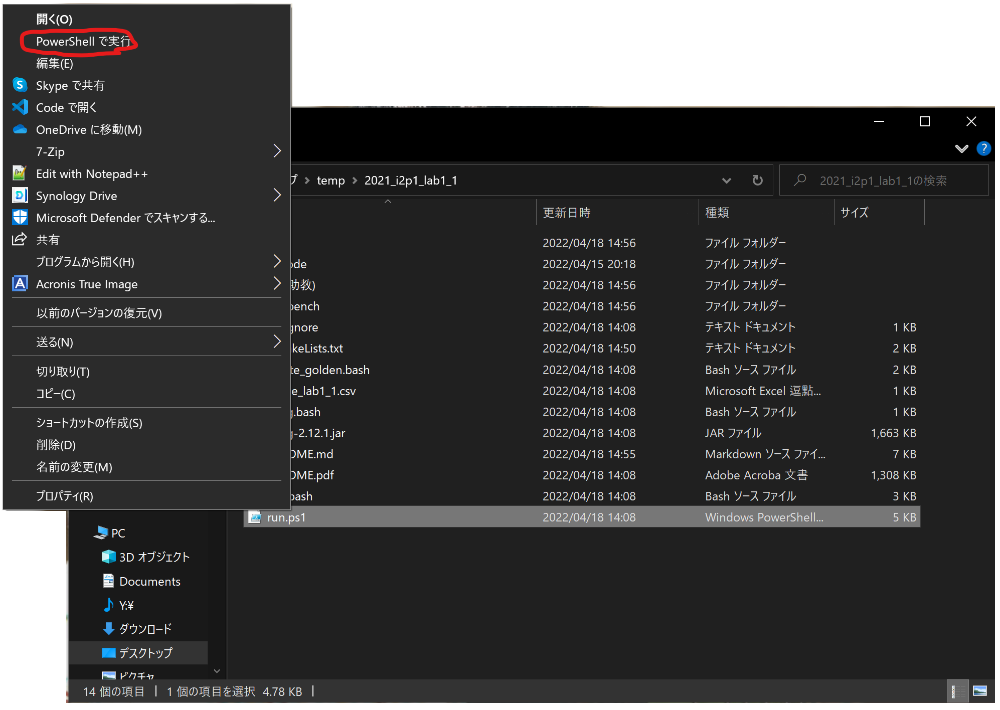

# 建立標準答案

## 0. 安裝 CMake

請從 https://cmake.org/download/ 上下載對應系統的安裝檔

並參考 https://cmake.org/install/ 步驟進行安裝

Note: PATH 步驟，請選擇 "Add CMake to the system PATH for all users"

## 1. 寫 TA 版本

在 `TA/` 資料夾下寫 TA 版本的程式碼，並取名 `<lab prefix>_TA.cpp` (e.g. 如果 `<lab prefix>` 是 `lab1_1` 則檔名是 `lab1_1_TA.cpp`)

## 2. 修改腳本 `create_golden.bash`

修改以下內容的 `prefix` 跟 1. 的 `<lab prefix>` 相同

```bash
#!/bin/bash

prefix="lab1_1"
testbench="testbench/"
build_dir="build/"
```

## 3. 修改腳本 `CMakeLists.txt`

修改以下內容的 `project` 跟 1. 的 `<lab prefix>` 相同

```cmake
SUBDIRLIST(SUBDIRS ${CMAKE_SOURCE_DIR})
list(REMOVE_ITEM SUBDIRS "testbench" "CMakeFiles" "build" "jplag" "jplag_result")

project(lab1_1)

FOREACH(subdir ${SUBDIRS})
  get_filename_component(bin_name ${subdir} NAME)
```

## 4. 執行 `create_golden.bash`

```console
$ bash create_golden.bash
lab1_1_01.in lab1_1_02.in lab1_1_03.in lab1_1_04.in lab1_1_05.in 5
TA/
build cpp
-- The C compiler identification is AppleClang 12.0.0.12000032
-- The CXX compiler identification is AppleClang 12.0.0.12000032
-- Detecting C compiler ABI info
-- Detecting C compiler ABI info - done
-- Check for working C compiler: /Library/Developer/CommandLineTools/usr/bin/cc - skipped
-- Detecting C compile features
-- Detecting C compile features - done
-- Detecting CXX compiler ABI info
-- Detecting CXX compiler ABI info - done
-- Check for working CXX compiler: /Library/Developer/CommandLineTools/usr/bin/c++ - skipped
-- Detecting CXX compile features
-- Detecting CXX compile features - done
-- Configuring done
-- Generating done
-- Build files have been written to: /Users/stevenokm/waste/2021_i2p1_lab1/build
[ 50%] Building CXX object CMakeFiles/lab1_1_TA.dir/TA/lab1_1_TA.cpp.o
[100%] Linking CXX executable lab1_1_TA
[100%] Built target lab1_1_TA
build//lab1_1_TA < testbench//lab1_1_01.in 2> testbench//lab1_1_01.log | tr -d \ n > testbench//lab1_1_01.out
build//lab1_1_TA < testbench//lab1_1_02.in 2> testbench//lab1_1_02.log | tr -d \ n > testbench//lab1_1_02.out
build//lab1_1_TA < testbench//lab1_1_03.in 2> testbench//lab1_1_03.log | tr -d \ n > testbench//lab1_1_03.out
build//lab1_1_TA < testbench//lab1_1_04.in 2> testbench//lab1_1_04.log | tr -d \ n > testbench//lab1_1_04.out
build//lab1_1_TA < testbench//lab1_1_05.in 2> testbench//lab1_1_05.log | tr -d \ n > testbench//lab1_1_05.out
$
```

# 作業批改

## 0. 安裝 CMake

請參考 **建立標準答案 - 0. 安裝 CMake**

## 1. 新增學生資料夾

學生的作業需要依照以下方式儲存

* 學生的檔案需要放在 `<學號>/` 資料夾內 (e.g. `106062802/`)
* 學生的 `main` 一定要放在 `<學號>/<lab prefix>_<學號>.cpp` 內 (e.g. `106062802/lab1_1_106062802.cpp`)

## 2. 修改腳本 `run.bash` (or `run.ps1` in Windows)

Note: 若要跳過 **建立標準答案**，請先完成 **3. 修改腳本 `CMakeLists.txt`** 後繼續。

修改以下內容的 `prefix` 跟 1. 的 `<lab prefix>` 相同

### `run.bash`

```bash
#!/bin/bash
prefix="lab1_1"
oc="grade_${prefix}.csv"
# remember to change both run.bash and CMakeList.txt files to the correct lab name
testbench="testbench/"
build_dir="build/"
```

### `run.ps1`

```ps1
$OutputEncoding = [console]::InputEncoding = [console]::OutputEncoding = [Text.UTF8Encoding]::UTF8
$prefix = "lab1_1"
$oc = ("grade_" + $prefix + ".csv")
# remember to change both run.bash and CMakeList.txt files to the correct lab name
$testbench = "testbench"
$build_dir = "build"
```

## 3. 執行 `run.bash` (or `run.ps1` in Windows)

### `run.bash`

```console
$ bash run.bash
lab1_1_01.in lab1_1_02.in lab1_1_03.in lab1_1_04.in lab1_1_05.in 5
106062802/ TA/
build cpp
-- Configuring done
-- Generating done
-- Build files have been written to: /Users/stevenokm/waste/2021_i2p1_lab1/build
Consolidate compiler generated dependencies of target lab1_1_TA
[ 50%] Built target lab1_1_TA
[ 75%] Building CXX object CMakeFiles/lab1_1_106062802.dir/106062802/lab1_1_106062802.cpp.o
[100%] Linking CXX executable lab1_1_106062802
[100%] Built target lab1_1_106062802
rm: grade.csv: No such file or directory
build//lab1_1_106062802 < testbench//lab1_1_01.in | tr -d \ n > 106062802/lab1_1_01.out; diff -w -B -i testbench//lab1_1_01.out 106062802/lab1_1_01.out > 106062802/lab1_1_01.log
build//lab1_1_106062802 < testbench//lab1_1_02.in | tr -d \ n > 106062802/lab1_1_02.out; diff -w -B -i testbench//lab1_1_02.out 106062802/lab1_1_02.out > 106062802/lab1_1_02.log
build//lab1_1_106062802 < testbench//lab1_1_03.in | tr -d \ n > 106062802/lab1_1_03.out; diff -w -B -i testbench//lab1_1_03.out 106062802/lab1_1_03.out > 106062802/lab1_1_03.log
build//lab1_1_106062802 < testbench//lab1_1_04.in | tr -d \ n > 106062802/lab1_1_04.out; diff -w -B -i testbench//lab1_1_04.out 106062802/lab1_1_04.out > 106062802/lab1_1_04.log
build//lab1_1_106062802 < testbench//lab1_1_05.in | tr -d \ n > 106062802/lab1_1_05.out; diff -w -B -i testbench//lab1_1_05.out 106062802/lab1_1_05.out > 106062802/lab1_1_05.log
build//lab1_1_TA < testbench//lab1_1_01.in | tr -d \ n > TA/lab1_1_01.out; diff -w -B -i testbench//lab1_1_01.out TA/lab1_1_01.out > TA/lab1_1_01.log
build//lab1_1_TA < testbench//lab1_1_02.in | tr -d \ n > TA/lab1_1_02.out; diff -w -B -i testbench//lab1_1_02.out TA/lab1_1_02.out > TA/lab1_1_02.log
build//lab1_1_TA < testbench//lab1_1_03.in | tr -d \ n > TA/lab1_1_03.out; diff -w -B -i testbench//lab1_1_03.out TA/lab1_1_03.out > TA/lab1_1_03.log
build//lab1_1_TA < testbench//lab1_1_04.in | tr -d \ n > TA/lab1_1_04.out; diff -w -B -i testbench//lab1_1_04.out TA/lab1_1_04.out > TA/lab1_1_04.log
build//lab1_1_TA < testbench//lab1_1_05.in | tr -d \ n > TA/lab1_1_05.out; diff -w -B -i testbench//lab1_1_05.out TA/lab1_1_05.out > TA/lab1_1_05.log
$
```

### `run.ps1`

以滑鼠右鍵按一下`run.ps1`，然後選取 **使用 PowerShell 執行**。



``` console
Execution Policy Change
The execution policy helps protect you from scripts that you do not trust. Changing the execution policy might expose
you to the security risks described in the about_Execution_Policies help topic at
https:/go.microsoft.com/fwlink/?LinkID=135170. Do you want to change the execution policy?
[Y] Yes  [A] Yes to All  [N] No  [L] No to All  [S] Suspend  [?] Help (default is "N"): a
lab1_1_01.in
lab1_1_02.in
lab1_1_03.in
lab1_1_04.in
lab1_1_05.in
5
TA (助教)
1
copy source files


    ディレクトリ: D:\stevenokm\Desktop\temp\2021_i2p1_lab1_1


Mode                 LastWriteTime         Length Name
----                 -------------         ------ ----
d-----        2022/04/18     15:03                src


    ディレクトリ: D:\stevenokm\Desktop\temp\2021_i2p1_lab1_1\src


Mode                 LastWriteTime         Length Name
----                 -------------         ------ ----
d-----        2022/04/18     15:03                TA
build cpp


    ディレクトリ: D:\stevenokm\Desktop\temp\2021_i2p1_lab1_1


Mode                 LastWriteTime         Length Name
----                 -------------         ------ ----
d-----        2022/04/18     15:03                build
-- The C compiler identification is GNU 8.1.0
-- The CXX compiler identification is GNU 8.1.0
-- Detecting C compiler ABI info
-- Detecting C compiler ABI info - done
-- Check for working C compiler: C:/Users/stevenokm/scoop/apps/mingw/current/bin/gcc.exe - skipped
-- Detecting C compile features
-- Detecting C compile features - done
-- Detecting CXX compiler ABI info
-- Detecting CXX compiler ABI info - done
-- Check for working CXX compiler: C:/Users/stevenokm/scoop/apps/mingw/current/bin/g++.exe - skipped
-- Detecting CXX compile features
-- Detecting CXX compile features - done
-- Configuring done
-- Generating done
-- Build files have been written to: D:/stevenokm/Desktop/temp/2021_i2p1_lab1_1/build
[ 50%] Building CXX object CMakeFiles/lab1_1_TA.dir/src/TA/lab1_1_TA.cpp.obj
[100%] Linking CXX executable lab1_1_TA.exe
[100%] Built target lab1_1_TA
eval build\lab1_1_TA.exe
build\lab1_1_TA.exe < testbench\lab1_1_01.in | tr -d \n > TA (助教)\lab1_1_01.out; cat TA (助教)\lab1_1_01.log >> TA (助教)\lab1_1_01.out; diff -w -B -i testbench\lab1_1_01.out TA (助教)\lab1_1_01.out > TA (助教)\lab1_1_01.log
build\lab1_1_TA.exe < testbench\lab1_1_02.in | tr -d \n > TA (助教)\lab1_1_02.out; cat TA (助教)\lab1_1_02.log >> TA (助教)\lab1_1_02.out; diff -w -B -i testbench\lab1_1_02.out TA (助教)\lab1_1_02.out > TA (助教)\lab1_1_02.log
build\lab1_1_TA.exe < testbench\lab1_1_03.in | tr -d \n > TA (助教)\lab1_1_03.out; cat TA (助教)\lab1_1_03.log >> TA (助教)\lab1_1_03.out; diff -w -B -i testbench\lab1_1_03.out TA (助教)\lab1_1_03.out > TA (助教)\lab1_1_03.log
build\lab1_1_TA.exe < testbench\lab1_1_04.in | tr -d \n > TA (助教)\lab1_1_04.out; cat TA (助教)\lab1_1_04.log >> TA (助教)\lab1_1_04.out; diff -w -B -i testbench\lab1_1_04.out TA (助教)\lab1_1_04.out > TA (助教)\lab1_1_04.log
build\lab1_1_TA.exe < testbench\lab1_1_05.in | tr -d \n > TA (助教)\lab1_1_05.out; cat TA (助教)\lab1_1_05.log >> TA (助教)\lab1_1_05.out; diff -w -B -i testbench\lab1_1_05.out TA (助教)\lab1_1_05.out > TA (助教)\lab1_1_05.log
Press Enter to Continue:
```

# 抄襲檢查

## 0. 安裝 openjdk

### macOS

```console
brew install openjdk
```

### Linux (Debian/Ubuntu)

```console
sudo apt-get install openjdk-11-jdk
```

### Linux (Fedora/Oracle Linux/RHEL)

```console
sudo yum -y install  java-11-openjdk java-11-openjdk-devel
```

## 1. 執行 `jplag.bash`

```console
$ bash jplag.bash
Language accepted: C/C++ Scanner [basic markup]
Command line: -s -l c/c++ -r jplag_result jplag
initialize ok
2 submissions

2 submissions parsed successfully!
0 parser errors!


Comparing 106062802-TA: 100.0

Writing results to: jplag_result
$
```

結果會放在 `jplag_result/index.html` 內，可用瀏覽器打開
